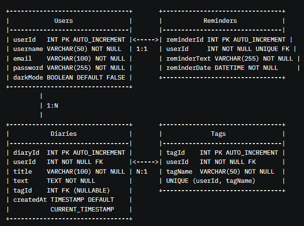

# Personal-Diary


# <span style="color:rgb(32, 99, 155)">Requirements</span>

1. Diary Management
2. Login/Register system
3. Browsing & Sorting Entries
4. Search Functionality <span style="color:rgb(237, 85, 59)">(INSIDE DIARY)</span>
5. Diary Reminders
6. System Theme
7. Export Diaries
8. Diaries Tagging

# <span style="color:rgb(32, 99, 155)">Forms/GUI</span>

- Welcome Menu (transitions to "Login" & "Register forms")
- Login (transition to Welcome Menu) - "login a new user"
- Register (transition to Welcome Menu) - "register a new user"
- Home (transition to Welcome menu "logout") : form (user menu) - "add button for dark mode" - "select diaries associated with this tag " - "sort -> title alpha || date" - "browse and manage diary" - "add button for manage tags"
- Writing Diary (Search a word inside a diary | edit diary) - "select tag" - "export diary"
- Tag Form: add and delete tags
- Reminder Form: "reminder to write diary in a SPECIFIC DATE & TIME"

# <span style="color:rgb(32, 99, 155)">Database</span> 

- I want a database in which we have :
	- user containing userid, username, email and a password.
	- each user has multiple diaries, he also can add a reminder so there is one reminder per user or none. 
	- a user can add and delete his OWN tags to use for each diary. 
	- a user can change the system theme by toggling dark mode.
	- a diary contains a name and text and an optional tag.


# <span style="color:rgb(32, 99, 155)">Database Relational Schema</span>

This document describes the relational schema for a diary application database, including the `Users`, `Diaries`, `Reminders`, and `Tags` tables and their relationships.

## <span style="color:rgb(237, 85, 59)">Tables</span>

### <span style="color:rgb(255, 61, 154)">Users</span>

Stores user information, including login credentials and preferences.

```sql
CREATE TABLE Users(
    userId INT PRIMARY KEY,
    username VARCHAR(50) NOT NULL UNIQUE,
    email VARCHAR(100) NOT NULL UNIQUE,
    password VARCHAR(255) NOT NULL,
    darkMode CHAR(1) DEFAULT '0'
);
```

|Column|Type|Constraints|
|---|---|---|
|userId|INT|PRIMARY KEY, AUTO_INCREMENT|
|username|VARCHAR(50)|NOT NULL, UNIQUE|
|email|VARCHAR(100)|NOT NULL, UNIQUE|
|password|VARCHAR(255)|NOT NULL|
|darkMode|BOOLEAN|DEFAULT FALSE|

### <span style="color:rgb(255, 61, 154)">Diaries</span>

Stores diary entries, each linked to a user and optionally a tag.

```sql
CREATE TABLE Diaries(
    diaryId INT PRIMARY KEY,
    userId INT NOT NULL,
    title VARCHAR(100) NOT NULL,
    text clob NOT NULL,
    tagId INT,
    createdAt TIMESTAMP DEFAULT CURRENT_TIMESTAMP,
    FOREIGN KEY (userId) REFERENCES Users(userId) ON DELETE CASCADE,
    FOREIGN KEY (tagId) REFERENCES Tags(tagId) ON DELETE SET NULL
);
```

| Column    | Type         | Constraints                                             |
| --------- | ------------ | ------------------------------------------------------- |
| diaryId   | INT          | PRIMARY KEY, AUTO_INCREMENT                             |
| userId    | INT          | NOT NULL, FOREIGN KEY (Users.userId), ON DELETE CASCADE |
| title     | VARCHAR(100) | NOT NULL                                                |
| text      | TEXT         | NOT NULL                                                |
| tagId     | INT          | FOREIGN KEY (Tags.tagId), ON DELETE SET NULL, NULLABLE  |
| createdAt | TIMESTAMP    | DEFAULT CURRENT_TIMESTAMP                               |

### <span style="color:rgb(255, 61, 154)">Reminders</span>

Stores one optional reminder per user.

```sql
CREATE TABLE Reminders(
    reminderId INT PRIMARY KEY,
    userId INT NOT NULL UNIQUE,
    reminderText VARCHAR(255) NOT NULL,
    reminderDate TIMESTAMP NOT NULL,
    FOREIGN KEY (userId) REFERENCES Users(userId) ON DELETE CASCADE
);
```

|Column|Type|Constraints|
|---|---|---|
|reminderId|INT|PRIMARY KEY, AUTO_INCREMENT|
|userId|INT|NOT NULL, UNIQUE, FOREIGN KEY (Users.userId), ON DELETE CASCADE|
|reminderText|VARCHAR(255)|NOT NULL|
|reminderDate|DATETIME|NOT NULL|

### <span style="color:rgb(255, 61, 154)">Tags</span>

Stores user-specific tags that can be applied to diaries.

```sql
CREATE TABLE Tags(
    tagId INT PRIMARY KEY,
    userId INT NOT NULL,
    tagName VARCHAR(50) NOT NULL,
    FOREIGN KEY (userId) REFERENCES Users(userId) ON DELETE CASCADE,
    UNIQUE (userId, tagName)
);
```

|Column|Type|Constraints|
|---|---|---|
|tagId|INT|PRIMARY KEY, AUTO_INCREMENT|
|userId|INT|NOT NULL, FOREIGN KEY (Users.userId), ON DELETE CASCADE|
|tagName|VARCHAR(50)|NOT NULL, UNIQUE (userId, tagName)|

## <span style="color:rgb(237, 85, 59)">Relationships</span>

- **<span style="color:rgb(147, 122, 255)">Users to Diaries</span>**: One-to-Many
    
    - One user can have multiple diaries.
    - `Diaries.userId` is a foreign key referencing `Users.userId`.
    - `ON DELETE CASCADE`: Deleting a user deletes their diaries.
- **<span style="color:rgb(147, 122, 255)">Users to Reminders</span>**: One-to-One (or One-to-Zero-or-One)
    
    - Each user can have at most one reminder, enforced by `UNIQUE(userId)` in `Reminders`.
    - `Reminders.userId` is a foreign key referencing `Users.userId`.
    - `ON DELETE CASCADE`: Deleting a user deletes their reminder (if any).
- **<span style="color:rgb(147, 122, 255)">Users to Tags</span>**: One-to-Many
    
    - One user can have multiple tags.
    - `Tags.userId` is a foreign key referencing `Users.userId`.
    - `ON DELETE CASCADE`: Deleting a user deletes their tags.
- **<span style="color:rgb(147, 122, 255)">Tags to Diaries</span>**: One-to-Many (Optional)
    
    - One tag can be associated with multiple diaries, but each diary has at most one tag (or none, as `tagId` is nullable).
    - `Diaries.tagId` is a foreign key referencing `Tags.tagId`.
    - `ON DELETE SET NULL`: Deleting a tag sets `tagId` to `NULL` in associated diaries.

## <span style="color:rgb(237, 85, 59)">Notes</span>

- The `UNIQUE (userId, tagName)` constraint in `Tags` ensures each user’s tags have unique names within their own set, but different users can have tags with the same name.
- The `tagId` in `Diaries` is nullable, allowing diaries to have no tag.
- Application logic should ensure that a diary’s `tagId` references a tag belonging to the same user (i.e., `Tags.userId = Diaries.userId`).

### <span style="color:rgb(255, 61, 154)">Drawing</span>


